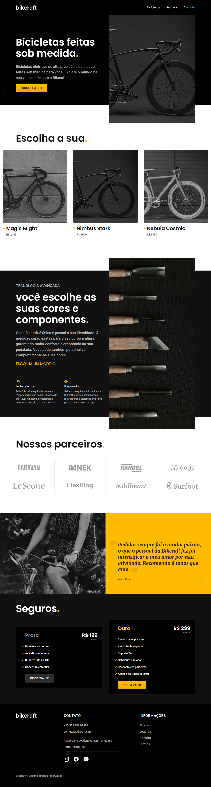
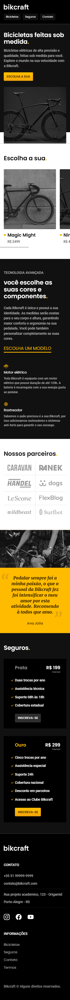

# Bikcraft! 
## Projeto acadêmico

## Resumo

Temos um site interativo e responsivo de uma loja de bicicletas com várias páginas e funcionalidades, também foi usado o Animate.css e o wow.js para leves animações e com algumas modificações para melhor experiência do usuário. Projeto desenvolvido em HTML, CSS e JavaScript. 
(Projeto acadêmico)

## Tecnologias utilizadas

    
    
    

## Imagem completa do site
### Desktop

### Mobile

## Acesse o Projeto

Você pode acessar o projeto através do link abaixo:

➜ [Link do projeto Lobo](https://ezequiel-lee.github.io/bikcraft/)

## Agradecimentos

(Agradecimentos ao André da Origamid pelo conhecimento.)
